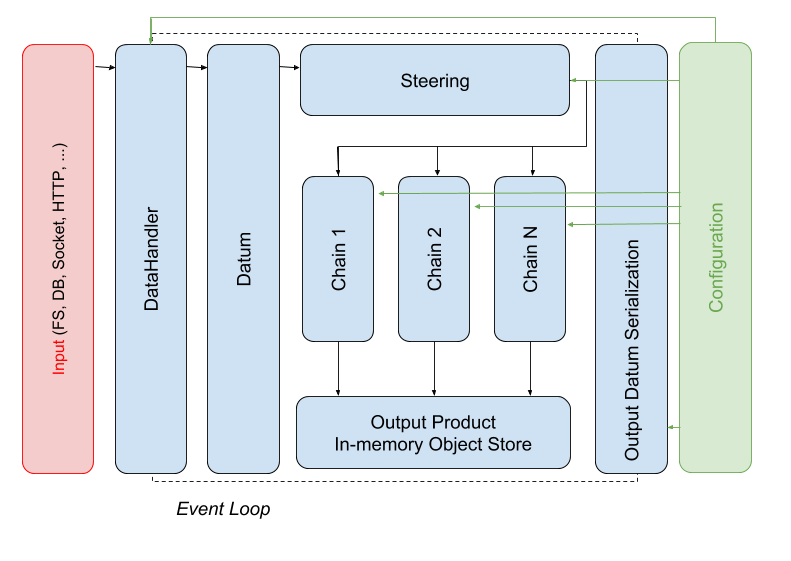

# Artemis

Artemis is a generic administrative data processing framework powered by Apache Arrow. 
The Artemis prototype presented in this document is a python data processing system 
with the following objectives: 

* Demonstrate the use of the Apache Arrow standard data model for tabular data.
* Demonstrate the ability to represent generic business processes in the form of directed 
acyclic graphs which can be executed in-memory to transform tabular data efficiently.
* Demonstrate the use of a histogram-based data validation and quality assurance framework.

The design decisions for Artemis must uphold data scientists core requirements for performing 
rigourous data analysis and the requirements defined by the Common Statistical Production Achitecture (CSPA). 
Furthermore, design choices align with the Apache Arrow objective to provide a development platform for data science systems
which decouples the vertical integration of data processing components:

* Job configuration and algorithm scheduling (Metadata management)
* I/O and deserialization (Data management)
* In-memory storage (Data format standardization)
* Computing engine (Code re-use)

## Introduction

The use of non-traditional administrative data for Official Statistics has a several notable features:

* Data is closest to the true nature of demographics.
* Preservation of the raw state of the data for analysts is required to extract the information.
* Data access patterns differ from traditional survey data.

Traditional sampling survey defines in advance the data which is collected,
thus facilitating the creation of a data model with a schema that can be enforced on write.

The challenge presented to Official Statistics agencies is how to ingest, store and process adminstrative while 
preserving the raw nature of the data for analysts. 
This challenge is significantly inhibited by a lack
of common data format with which to record the data and to analyze the data in-memory. 

* Variety of file formats are acquired with no common tool to read or convert data to a more suitable format in an organization.
* Enforcing schema on write can impede or prevent the ingestion of data.
* Traditional database modeling focuses on optimizing write operations for transactional, row oriented data.
* Conversion of data to a propriety organizational data format or model can inhibit collaboration.
* Ingestable data formats, such as csv, may be convenient but are not efficient on disk or in-memory.
* Data conversions result in loss of information, significant performance overhead, and sustain fractured data architectures systems.

Analytical workloads for administrative data sources which reside in a data store (filesystem, distributed datastore, object store, etc...) 
will follow a pattern of write once, read many times. Analysts will iterate many times on a master data set to produce subsets of data tailored to the analysis and
business needs. Analytical queries will have common data access patterns such as 

* reading subsets of columns for large number of rows at a time.
* accessing elements in adjacent columns in succession. 

These data access patterns can benefit from column oriented table structures over traditional row-oriented access patterns which are more commonly found
in traditional databases.

Common data format which defines data primitive types that occur in data science, social science and business data will ensure that the
raw state of the data can be preserved when consumed by organizations. 

### Administrative Data Preprocessing and Processing Requirements

Description of current ADD processing.

### Data standardization

Open standards allow for systems to directly communicate with each other.
Direct communication using standard protocols and data formats 
* simplifies system architecture
* reduces ecosystem fragmentation
* improves interoperability across processes. 
* eliminates dependency on proprietary systems.
Most importantly, common data formats faciliate code reuse, sharing, effective collaboration 
and data exchange, resulting in algorithms and libraries which are supported by a large open community.  

Several examples of data standards in computing today:
* Human-readable semi-structured: XML, JSON
* Structure data query lanaguage: SQL has various flavors (MySQL, PostgreSQL, etc...)
* Binary data (with metadata), several from the scientific community
    * NetCDF
    * HDF5
    * Apache Parquet, ORC
    * PAW tuples and ROOT TTree 
* Binary blobs via RPC protocols
    * Apache Avro
    * Protocol buffers (Google)

The scientific community developed many common libraries in-use by data scientists
today in Fortran, such as linear algebra routines. The scientific programming ecosystem
in python effectively united around the ndarray, which is the NumPy multidimensional
fortran-compatible array which allows for re-use of linear algrabra routines, providing 
zero-overhead memory sharing to/from various libraries and processes.

The data science and social science community typically deal with tabular data which
manifests itself in various forms, most commonly refered to as DataFrames. The dataframe
concept and the semantics found in various systems are common to the various DataFrames. 
However, the underlying byte-level memory represention varies across systems. The difference in
the in-memory representation prevents sharing of algorithmic code across various systems and 
programming languages. Effectively, no standard exists for in-memory
tabular data. Common examples of tabular data in-use today by data and social scientists:

* Tabular data is commonly found in SQL.
* Big data community developed Spark and Hive.
* In-memory data frame in data science languages: 
python has pandas, R has data.table, and Julia has jil.table.

Tha Apache Arrow project solves the non-portable dataframe problem by
providing a cross-language development platform for in-memory data which specifies a 
standardized language-independent columnar memory format for flat and hierarchical data, 
organized for efficient analytic operations on modern hardware. Arrow provides computational 
libraries and zero-copy streaming messaging and interprocess communication. The key benefits of Arrow:

Fast – enables execution engines to take advantage of the latest SIMD (Single input multiple data) operations in modern processes, for native vectorized optimization of analytical data processing. Columnar layout is optimized for data locality for better performance. The Arrow format supports zero-copy reads for fast data access without serialization overhead.

Flexible – Arrow acts as a high performance interface between various systems and supports a wide variety of industry specific languages, including Python, C++ with Go in progress.

Standard – Apache Arrow is backed by key developers from major open-source projects.

Arrow defines language agnostic column-oriented data structures for array data which include 
(see the Columnar Format 1.0 Milestone on Arrow Confluence https://cwiki.apache.org/confluence/display/ARROW/Columnar+Format+1.0+Milestone):

* Fixed-length primitive types: numbers, booleans, date and times, fixed size binary, decimals, and other values that fit into a given number
* Variable-length primitive types: binary, string
* Nested types: list, struct, and union
* Dictionary type: An encoded categorical type

The Arrow column-oriented in-memory format provides serialization/deserialization and supports persistency to various
column-oriented backend storage systems and formats. The choice for column-oriented format is based
on the benefits achieved for performance reasons.
* Common access patterns that benefit from column-oriented data access
    * Access elements in adjacent columns in succession.
    * Efficient access to specific columns.
* Enables SIMD (Single instruction multiple data) based algorithms
* Vectorized algorithms
* Columnar compression.

The development platform goal of Apache Arrow is to deconstruct the typical data architecture
stack that is vertically integrated, providing public APIs for each component:

* IO/Deserialize
* In-memory storage
* Compute engine
* Front-end API

where the latter front-end API is really up to the users who are developing Arrow powered
data science systems.

## Artemis Prototype

The Artemis prototype framework leverages the Apache Arrow development platform capability.
The design focuses on data processing and analysis in a collaborative and reproducible manner.
The front-end agnostic Arrow API allows us to define a data model to manage the sharing of tabular data
across sequences of algorithms, which describe various (sometimes disparate) business processes, in a single in-memory
data processing job. The algorithms describe various (sometimes disparate) business processes for the same dataset, and
the algorithms can be re-used for different datasets with common pre-processing and processing requirements.

The prototype not only must demonstrate various capabilities and potential use of data standardization
but also test the validity of assumptions of processing adminstrative data files

* Data can be converted, stored and analyzed in a tabular data format.
* Data can be partitioned and processed independently, in parallel, 
facilitating both vertical and horizontal scaling 
(multi-processing (across cores) and distributed computing (across nodes).
* If the latter assumption fails, aggregated data stored in histograms can be used as input in 
subsequent processing to process the data in parallel. (E.g. imputation based on field mean).

Assumptions set forth for Artemis are derived from event-based data processing frameworks 
from high-energy physics. Therefore, many design choices have been adopted from large-scale
data processing systems used in the HEP community.

Artemis framework design features

* Seperation of algorithmic code and configuration.
* Seperation of I/O from data processing.
* Managed I/O at the framework level to minimize read/write. 
* State machine for job control flow to ensure reliablity.
* Managed data pipeline algorithms to guarantee data dependencies.
* In-memory provenance of data transformations.
* Modular code design to faciliate code re-use, simplify testing and development.
* Automatic collection of processing metrics.
* User-defined histograms and data tables.

Artemis framework defines a common set of base classes for user defined *Chains* as 
an ordered collection of algorithms and tools which transform data. User-defined 
algorithms inherit methods which are invoked by the Artemis application, such that the *Chains* are managed by a *Steering* algorithm. 
Artemis manages the the data processing *Event Loop*, provides data to the algorithms, and handles data serialization
and job finalization.

### State Machine

Artemis job control flow is implemented as a state machine to provide deterministic, fault tolerant
data processing. Artemis defines *States* which undergo *Transitions* from one another via
*Triggers*. *Triggers* invoke *Transitions* functions which must succesfully execute in order for the application
to proceed via *State Transitions*. The state machine implementation is currently facilitated by the python library *Transitions*.
Explicit definition of *States* naturally factorize the application into distinct stages, simplyfying error handling and job management.
The *Transition* functions can invoke separate classes, modules, or even processes to handle certain
tasks.

State machines are common in event-driven data processing systems and application frameworks.
A state machine can be described as a directed graph which consists of a set of nodes (*States*)
with a corresponding set of *Transition* functions. The machine runs by responding to a series of events.
In the case of Artemis, this is a predefined control flow to take the job from a dormant or ready state to
a finalization state. Each event is in the scope of the *Transition* function belonging to the current node, where the function
range is a subset of the nodes.

**State Definitions**

* *Quiescent or Dormant* -- Artemis object instantiation and initial state of the machine.
* *Start* - Job start
* *Configuration* - Configure all required services, e.g. connections, handles for data access, etc...
* *Initialization* - Define all job, algorithm and tool properties for executing and reproducing the job.
* *Lock* - Freeze the job configuration
* *Meta* - Persist the job configuration
* *Book* - Configure additional metadata information to be collected throughout the data processing for
data processing, process profiling and process metrics (input and output rates) 
    * histograms
    * timers
    * counters
* *Run* - Loop over data requests. Outer part of the Event Loop.
* *Execution* - Algorithm execution over the datums. Effectively is the inner part of an Event Loop.
* *End*
* *Abort*
* *Error*
* *Finalize*

### Data Handle and Access

I/O and data access are currently managed by a seperate class. Modularity of I/O would allow 
for a seperate process entirely to serve data to the application.
In the case of a seperate process this may allow for asyncronous buffering of data 
from a filesystem, database or network node while processing
of the actual data continues in Artemis. Generically, Artemis will interact with a *DataHandler* whereby
the *DataHandler* is a data producer which interacts with the persistent data to load into a memory buffer
Artemis is a data consumer that concumes the *DataHandler* buffer and fills its own output buffer.
Artemis sends a data request. The DataHandler
manages the request, fills a buffer and returns a generator which is consumed by Artemis.
The *DataHanlder* provides a python generator of partitions of data in predetermined chunk sizes.
Artemis *Run* and *Execution* states manage the processing of data chunks and serves these to the algorithms.

**Assumption** 

Each job receives a subset of a complete dataset. Each subset is partioned into
chunks up to a predetermined chunk size. 

### Algorithm scheduling via DAGs and topological sorting

Artemis design decouples the job configuration and the algorithm scheduling from the job and algorithm
execution. The entire job is defined in metadata that can be persisted. This flexibility allows
for dynamic creation of algorithms to run on the same data with different configurations, 
allows for the job to be reproducible, and facilitates data validation and code testing.
The algorithm scheduling and control flow is an extension of the Artemis state machine concept that
ensures that the data dependencies are met before the execution of an algorithm.

In order to provide a flexible means of defining business processes to execute on data, directed graphs
are defined by the user. User-defined inputs and outputs can be shared across algorithm sequences. The ordering of
the algorithmic execution is handled through a sorting algorithm. Users only need to ensure their pipeline defines the input(s), 
the sequence of algorithms to act on those inputs, and the output. 

**Definitions**

* *Sequence* - Tuple of algorithms (by name) which must be executed in the order defined.
* *Element* - Name of an output business process.
* *Chain* - Unordered list of input Elements (by name), a Sequence, and a single output Element.
* *Menu* - Collection of user-defined Chains to be processed on a particular dataset. 

Artemis application requires the topological sorted list of output Elements and Sequences. The topological sort 
of a directed graph is a linear ordering of the vertices such that for every directed edge *uv* from vertex *u* to vertex *v*,
*u* comes before *v* in the ordering. Artemis uses the python library toposort, available on PyPi, to create the ordered list.
For more information, please refer to the Wikipedia description of topological sorting.

**Assumption**

All business processes are acyclic.

### Base Classes and Properties

Only two base classes are anticipated for the Artemis prototype for user-defined algorithms. Base
classes are required so that the framework and *Steering* algorithm can manage the initialization, execution and
finalization of all user-defined algorithms. In addition, a generic *Properties* class can be used to decorate
user-defined algorithms with attributes that are retained as metadata.

* AlgoBase - For accessing data in user-defined algorithms, filling histograms from data tables and passing data to tools 
for fast computation of new quantities, features, tables, and/or arrays.

* ToolBase - Computational workhorse. User-defined tools can wrap existing python libraries and take as input Arrow data tables.

* Properties - Dynamically defined properties for algorithms and tools to allow for configurables at the Menu generation. Properties
provide code re-use by altering behavior of algorithm while leaving the algorithmic and computational functionality in tact.

### Data Provenance and data access

**TODO**
Description of the Tree data structure, Node and Element classes.

### Histogram-based Data Analysis

The Data Science ecosystem currently uses histograms primarily for interactive data visualization. However, histograms
are a powerful statistical tool to analyze large datasets. Histograms, in this sense, act primarily as tables of numbers
and would be similar to the disseminated census tables produced by Statistics Canada. However, with a properly implemented 
histogram class, histograms can filled and refilled through a large dataset, or in parallel and later combined with addition.
As a key component to the Artemis framework, a single histogram store will be available for user-defined histograms. 
Aggregated data, such as per-column distributions, can be stored in histograms. For large datasets, subsets of the data will
be produced in the form of histograms. Each subjob will produce a collection of histograms. Once the entire data set is processed
a postprocessing step will combine the histogram collections from each subjob to form the total aggregated profiles of the per-column distributions. 
The Histbook project is a python implementation similar to the histogramming packages developed and used for particle physics, such as CERN HBOOK
and modern-day ROOT histograms.

Histograms provide a convenient way to validate data both visually, overlaying control histograms with the processed histograms 
to observe deviations, and statistically by applying chi-squared, Person's or Kolmogorov-Smirnov tests to automatically
flag deviations from a control sample. Histograms are easily stored in a compact, efficient manner, can be easily viewed with
a variety of tools, and provide a data model from which to easily describe a dataset. Application of differential privacy algorithms 
can be applied to histograms which can serve as safe way to produce realistic synthetic data. The initial use case for Artemis
is to monitor job statistics and to implement a simple data validation workflow for data preprocessing.

**Assumption**

Multiple-pass processing will dynamically determine histogram binning for new datasets.

**TODO**
Diagram of anticipated data validation workflow.

## Milestones and Deliverables 

### Milestone
Artemis 0.1 release features

* Preprocessing algorithm on tax dataset to confirm record layout with Arrow type inference.
* Convert data to Arrow and store in a columnar data format (Parquet or serialized Arrow tables).
* Publish data validation histograms.

### Deliverables

* Data handler class. Reading and chunking of CSV file format from a linux filesystem. Dask IO code may be a suitable 
starting point.
* Job configuration data model. Reading and writing to/from JSON file format.
* State definitions, transitions, and trigger functions.
* Event loop for handling data requests and looping over partitioned data sets.
* In-memory model for data provenance (*Tree*, *Node*).
* Data class (*Element*) for holding input raw data and Arrow tabular data formats.
* Pre-processing algorithm using Arrow type-inference engine for data conversion, metadata extraction and validation.
* Finalization algorithm Arrow table serialization from data provenance model leave nodes.
* User-defined properties for algorithmic configuration.
* Global job histograms and job metrics (timers, counters).
* Histogram data store and user-defined histograms.
* Reading/writing histograms and post-processing for job and data validation. 
* Standalone post-processing application.

## Dependencies

* Pyarrow - Apache Arrow for python (https://pypi.org/project/pyarrow/)
* Toposort - topological sorting algorithm (https://pypi.org/project/toposort/)
* Transitions - python state machine (https://pypi.org/project/transitions/)
* Histbook - python histogram for aata analysis (https://pypi.org/project/histbook/)

## References:
* https://cwiki.apache.org/confluence/display/ARROW/Columnar+Format+1.0+Milestone
* [Ursa Labs](https://ursalabs.org/)
* http://wesmckinney.com/blog/announcing-ursalabs/
* https://mapr.com/blog/evolving-parquet-self-describing-data-format-new-paradigms-consumerization-hadoop-data/
* https://www.enigma.com/blog/moving-to-parquet-files-as-a-system-of-record
* https://www.kdnuggets.com/2017/02/apache-arrow-parquet-columnar-data.html
* https://www.slideshare.net/HadoopSummit/efficient-data-formats-for-analytics-with-parquet-and-arrow
* https://tech.blue-yonder.com/efficient-dataframe-storage-with-apache-parquet/
* https://www.mapd.com/blog/mapd-pandas-arrow/
* https://www.dremio.com/webinars/arrow-c
* [Projects Powered by Arrow](https://arrow.apache.org/powered_by/)
* https://www.ibm.com/developerworks/library/l-python-state/index.html
* http://python-3-patterns-idioms-test.readthedocs.io/en/latest/

Recent talk by Wes McKinney at the SciPy 2018 Conference, Austin, TX


